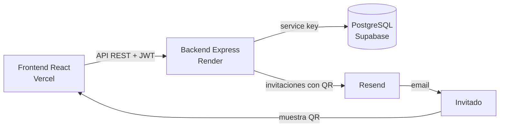

# Sistema de Control de Acceso por QR para Eventos

Aplicación web full stack para gestionar el ingreso de invitados a eventos mediante códigos QR. Reemplaza el control manual de listas en la puerta: cada invitado recibe su QR por email y el personal de acceso lo valida escaneándolo desde el celular.

Desarrollado como Práctica Profesional Supervisada de la Licenciatura en Sistemas de Información (Universidad Champagnat).

🔗 **Demo:** https://alto-belgrano-qr.vercel.app

---

## Funcionalidades

**Gestión de eventos e invitados**
- Alta, edición y eliminación de eventos.
- Importación masiva de invitados desde Excel (`nombre`, `apellido`, `dni`, `email`), con detalle de las filas inválidas.
- Alta y edición manual de invitados desde el panel.
- Envío automático de la invitación con su QR por email, en segundo plano y espaciado para respetar los límites del proveedor.
- Reenvío individual del QR.

**Control de acceso**
- Escáner de QR desde la cámara del celular.
- Ventana de validez por evento: el QR solo sirve desde unas horas antes del día del evento hasta un plazo después de su fin.
- El escáner opera sobre un evento elegido y rechaza QRs de otros eventos.
- Protección contra doble ingreso, incluso con dos escaneos simultáneos del mismo QR.
- Opción de deshacer un ingreso marcado por error.

**Panel de administración**
- Seguimiento de ingresos con actualización periódica.
- Gestión de usuarios con dos roles: **administrador** (panel completo) y **guardia** (solo escáner).
- Diseño responsive para uso desde el celular.

## Stack

| Capa | Tecnologías |
|---|---|
| Frontend | React 19, Vite, React Router, Axios, html5-qrcode |
| Backend | Node.js, Express 5, JWT, bcryptjs, ExcelJS, Multer, qrcode |
| Base de datos | PostgreSQL (Supabase) |
| Email | Resend |
| Deploy | Vercel (frontend), Render (backend) |

## Arquitectura



El frontend nunca accede directamente a la base de datos: todo pasa por la API. Todas las tablas tienen Row Level Security activo con acceso exclusivo del backend.

## Seguridad

El sistema maneja datos personales reales, por lo que se aplicó un endurecimiento específico:

- Rate limiting por IP y bloqueo de cuenta tras intentos fallidos de login.
- Contraseñas con bcrypt y comparación contra un hash dummy para evitar enumeración de usuarios.
- Revalidación del usuario en cada request: desactivar una cuenta o cambiar la contraseña revoca las sesiones al instante.
- Recuperación de contraseña por email con tokens de un solo uso.
- CORS restringido, Helmet, CSP estricta y límites de tamaño en requests y archivos.
- Escape de datos en los emails para evitar inyección de HTML.
- Registro de auditoría de acciones.
- Purga automática de los datos personales de los invitados después del evento, conservando solo conteos (Ley 25.326 de Protección de Datos Personales).

Detalle completo y orden de despliegue en [`SEGURIDAD.md`](SEGURIDAD.md).

## Estructura

```
├── backend/
│   ├── migrations/      # Scripts SQL para Supabase (ejecutar en orden)
│   ├── src/
│   │   ├── config/      # Variables de entorno y cliente de Supabase
│   │   ├── controllers/
│   │   ├── middlewares/ # Auth, rate limiting, manejo de errores
│   │   ├── routes/
│   │   ├── services/    # Email y procesamiento de Excel
│   │   └── utils/
│   └── server.js
├── frontend/
│   └── src/
│       ├── pages/       # Login, Dashboard, Escáner, Recuperar contraseña
│       ├── components/
│       ├── hooks/
│       └── services/    # Cliente de la API
└── SEGURIDAD.md
```

## Ejecución local

**Requisitos:** Node.js 20+, un proyecto de Supabase y una cuenta de Resend.

1. Ejecutar las migraciones de `backend/migrations/` en el SQL Editor de Supabase, en orden numérico.

2. Backend:
   ```bash
   cd backend
   cp .env.example .env   # completar las variables
   npm install
   node server.js
   ```

3. Frontend:
   ```bash
   cd frontend
   npm install
   # crear .env con VITE_API_URL=http://localhost:3000/api
   npm run dev
   ```

Para desarrollo local, agregar `http://localhost:5173` a `CORS_ORIGENES` en el `.env` del backend.

## Autor

**Ignacio Juri** — Estudiante de la Licenciatura en Sistemas de Información
📧 ignaciojuri12@gmail.com
